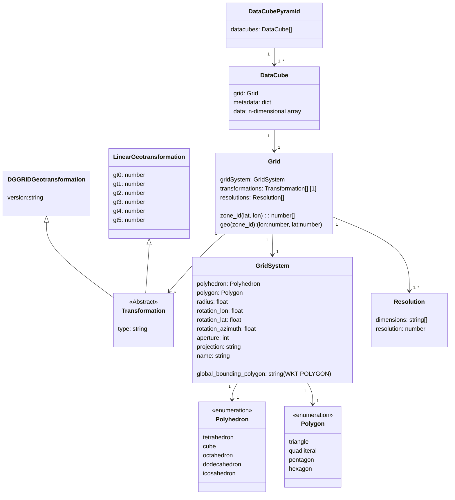

# Draft Specification for Data Stored in a Discrete Global Grid System

Daniel Loos, Max Planck Institute for Biogeochemistry, Jena, Germany

Date: 2023-10-25

Version: ongoing

Stage: Draft

The key words “MUST”, “MUST NOT”, “REQUIRED”, “SHALL”, “SHALL NOT”, “SHOULD”, “SHOULD NOT”, “RECOMMENDED”, “MAY”, and “OPTIONAL” in this document are to be interpreted as described in [RFC 2119](https://datatracker.ietf.org/doc/html/rfc2119).

## Preface

This specification is an early draft developed in the frame of the [Open Earth Monitor](https://earthmonitor.org/) project.
It builds on top of [OGC Topic 21](https://docs.ogc.org/as/20-040r3/20-040r3.html) i.e. [ISO 19170-1:2020](https://www.iso.org/standard/32588.html), Geographic Information — Discrete Global Grid Systems Specifications — Core Reference System and Operations, and Equal Area Earth Reference System.

Discrete Global Grid Systems (DGGS) tessellate the surface of the earth with hierarchical cells of equal area, minimizing distortion and loading time of large geospatial datasets, which is crucial in spatial statistics and building Machine Learning models.
Successful applications of DGGS include the prediction of flood events by integrating remote sensing data sets of different resolutions, as well as vector data.
Several tools were developed, mostly focusing on defining the grid and convert points from geographical space to DGGS zone ids, and vice versa.

However, no file format exist so far to store DGGS data nativeley.
This document aims to specify a suitable file format to suggest using it in further parts of [ISO 19170-1:2020](https://www.iso.org/standard/32588.html).

## DGGS

A DGGS is defined in [ISO 19170-1:2020](https://www.iso.org/standard/32588.html).

Briefly, a discrete global grid can be created using:

1. Take a platonic solid
1. Set the radius of it to those of the sphere
1. Set the rotational orientation of the solid relative to the sphere
1. Tesselate the surface of the solid using regular polygons defining the zones
1. Re-project the cell boundaries to the surface of the sphere

A DGGS is created by iterativeley creating grids at decreasing spatial resolutions.
Hereby, a parent-child relationship is defined between zones of sucessive resolutions.

To minimize distortions in terms of shape and area a DGGS:

- SHOULD be based on an icosahedron that is the platonic solid with the highest number of faces
- SHOULD be used with an projection that minimizes distortions e.g. Snyder Equal Area Projection

## Zone

A Zone is defined in [ISO 19170-1:2020](https://www.iso.org/standard/32588.html).
Briefly, zones are areas being defined by the tesselation of the polyhedron surfaces.
Each zone represents an area of the surface of the sphere.
A cell is the geometry representing the boundaries of a zone.
The tesselation MUST be unique and complete:
Each point in geographical space of the surface of the sphere must have one zone identifier.

Cells MUST be the same polygons whenever possible. For example, tesselations of the surface of a icosahedron with hexagons requires to add 12 pentagons.

## Zone identifier

A Zone identifier is defined in [ISO 19170-1:2020](https://www.iso.org/standard/32588.html).
Briefly, Zone identifiers are unique labels of zones.

There MAY be multiple systems of zone identifieres describing zones of the same grid, e.g., SEQNUM, PROJTRI and Q2DI for DGGRID grids, among others.

Zones with similar zone identifers MUST be nearby in geographical space.

Zone identifiers:

- MAY be tuples having multiple dimensions, e.g., DGGRID PROJTRI
- MAY encode hierarchical relatiopnship between zones at different spatial resolutions, e.g. using prefix codes in Uber H3
- MAY encode information about the angular direction to child zones (e.g. using Generalized balanced ternaries or Central Place Indexing [(Sahr 2013)](http://dx.doi.org/10.3138/cart.54.1.2018-0022)

## Zone index

A zone index is a bijective function $I:Z \mapsto M $ mapping all zone identifiers $z \in Z$ (labels) to unique numerical memory addresses $m \in M$.
The memory adress is a n-tuple of nonnegative integers for n-dimensional zone identifiers.
It is used in positional access of elements in the data array.
An zone index defines in which order zone values are stored.
Therefore, it defines the chunking of the data and influence loading time of the values.

- Zones with similar memory addresses MUST be nearby in geographical space.
- There SHOULD be one preferred zone index for each zone indentifier system.
- Zone indicies SHOULD be compact in memory space i.e. almost all numbers $m$ within $[0, \max(m)]$ SHOULD be used. Space filling curves MAY be used here (e.g. Hilbert curve like index in Google S2)


**Figure 1**: Merging 2 faces of a polyhedron to one rectangular chart [(Mahdavi-Amiri et al. 2014)](http://dx.doi.org/10.1080/17538947.2014.927597).

Memory addresses created by the zone index MUST describe rectangular grids.
This is just a vector for 1D zone identifieres.
Moreover, zone identifiers MAY describe zones as their position on the face of a polyhedron (e.g. DGGRID PROJTRI).
Hereby, the surface of the polyhedron is subdivided in charts that are as rectangular as possible (See Figure 1).
This allows to store DGGS data in n-dimensional arrays.

# Geotransformation

A geotransformation is a sequence of bijective functions applied to the memory addresses of a DGGS data cube to return the center point of the corresponding cell in geographical coordinates.
The inverse of the functions will be applied in reversed order to obtain the memory address from given geographical coordinates.

Example with one step of grids produced by DGGRID:

```json
[
  {
    "type": "dggrid",
    "version": "7.8"
  }
]
```

The identity function MUST be applied is an empty sequence is provided.
The parameter `type` MUST be provided in every geotransformation call.

Notes:

1.  The sequence is implemented as a JSON list, because JSON dictionaries are unordered.

## DGGRID geotransformation

This will call DGGRID.
Other required parameters will be inferred from the Grid oject.
A error message MUST be raised if this was unsuccessful (DGGRID not installed, ambigiuous parameters, missing parameters, etc.)

| name    | type   | description                  |
| ------- | ------ | ---------------------------- |
| version | string | Version of DGGRID to be used |

## Linear geotransformation

This is an implementation of [GDAL Geotransform](https://gdal.org/tutorials/geotransforms_tut.html).

| name | type   | description                                                                |
| ---- | ------ | -------------------------------------------------------------------------- |
| gt0  | number | x-coordinate of the upper-left corner of the upper-left pixel.             |
| gt1  | number | w-e pixel resolution / pixel width.                                        |
| gt2  | number | row rotation (typically zero).                                             |
| gt3  | number | y-coordinate of the upper-left corner of the upper-left pixel.             |
| gt4  | number | column rotation (typically zero).                                          |
| gt5  | number | n-s pixel resolution / pixel height (negative value for a north-up image). |

## DGGS Data Cube

A (regular) DGGS data cube is an n-dimensional array to store values of variables across the globe.
The values are arranged on a selected grid and zone index.
A user focused definition describes (geo) data cubes as a "discretized model of the earth that offers estimated values of certain variables for each partition of the Earth’s surface called a cell" [(OGC 2021)](https://www.ogc.org/initiatives/gdc).

There MUST be at least all spatial dimensions present needed for the selected zone identifier.
Values MUST be sampled in accordance to the selected grid.
DGGS data cubes are regular, i.e. there MUST NOT be missing values within the global bounding box.
Values MAY be interpolated.

## DGGS resolution

A DGGS resolution is collection of dimensions and a corresponding number representing the resolution level.
More detailed data cubes with a higher resolution have higher numbers.
A DGGS grid MUST have one resolution on spatial dimensions defined.
In addition, spatiotemporal DGGS grid MUST have one resolution on a temporal dimension defined.
Each dimension MUST NOT be used multiple times in all resolution definitions.
Only spatial or temporal dimensions SHOULD be used.

Example for a DGGRID grid with `dggs_res_spec` of 8 and PROJTRI zone identifiers:

```json
{
  "dimensions": ["triangle", "x", "y"],
  "resolution": 8
}
```

## DGGS Pyramid

A DGGS data cube pyramid is a collection of DGGS data cubes.
The only difference of those DGGS data cubes is that they have at meast different spatial resolutiosn.
Different temporal resolutions MAY be created as well yielding spatiotemporal DGGS.
Is so, all temporal resolutions MUST be created for all spatial resolutions (cross product).

Resolution is a property of a collection of axes

## DGGS Data Model



DGGS data model as an ER diagram.
Attributes above and below the line are required and optional, respectiveley.

Notes:

1.  Grid ISEA7H requires different (alternating) transformations at sucessive resolutions (pointy top vs flat top, Class I vs Class II)

Everything but the n-dimensional array itself of the DGGS data model will be stored as attributes of that array.

Example attributes of a DGGS data cube at a given resolution:

```json
{
  "grid": 2,
  "metadata": 5
}
```

## DGGS file format

A DGGS pyramid is stored as one file by mapping the DGGS pyramid class diagram to the [Common Data Model (CDM) V4](https://docs.unidata.ucar.edu/netcdf-java/current/userguide/common_data_model_overview.html#data-access-layer-object-model).
This allows to save the DGGS pyramid in various file formats e.g. NetCDF 4, HDF5 and Zarr.
DGGS data cubes MUST be stored in variables.
DGGS data cubes having the same temporal resolution MUST be stored in the same CDM group.
DGGS data cubes with a single spatiotemporal resolution MUST be stored in the root group.
File names SHOULD contain the phrase `dggs` e.g. `example.dggs.zarr`.
Required attrbutes MUST be stored as meta data in the files.
Cloud optimized file formats allowing HTPP range requests e.g. zarr SHOULD be used.
